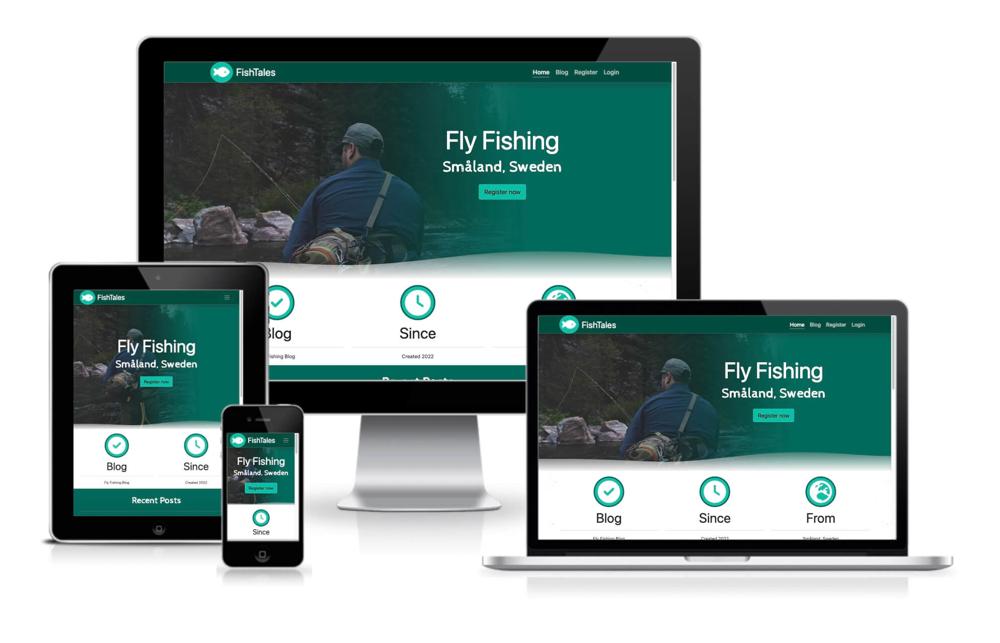
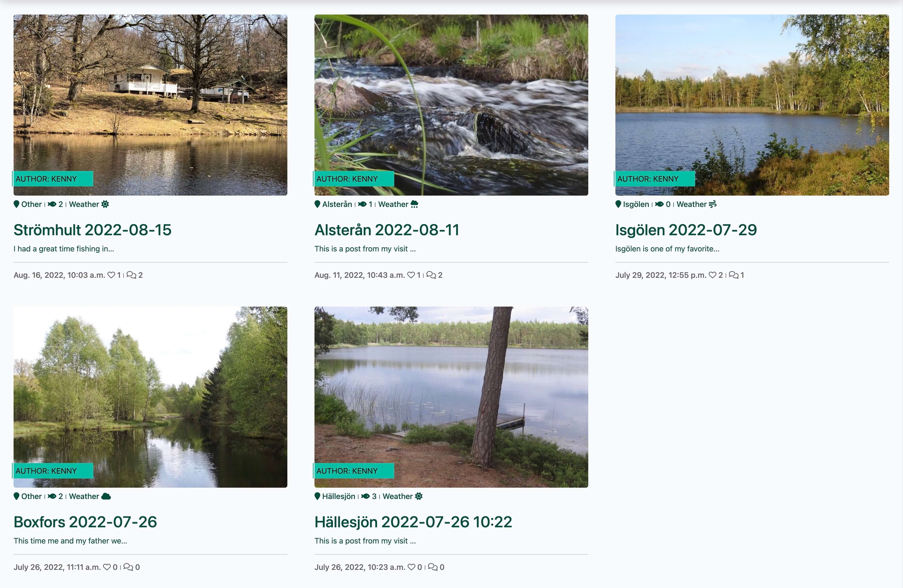
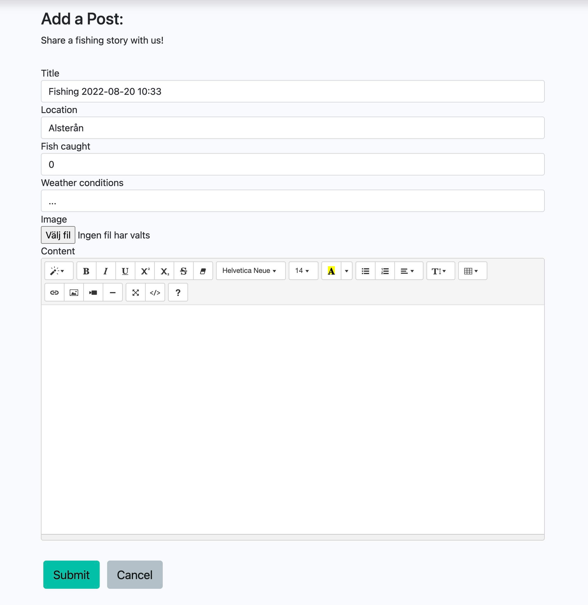
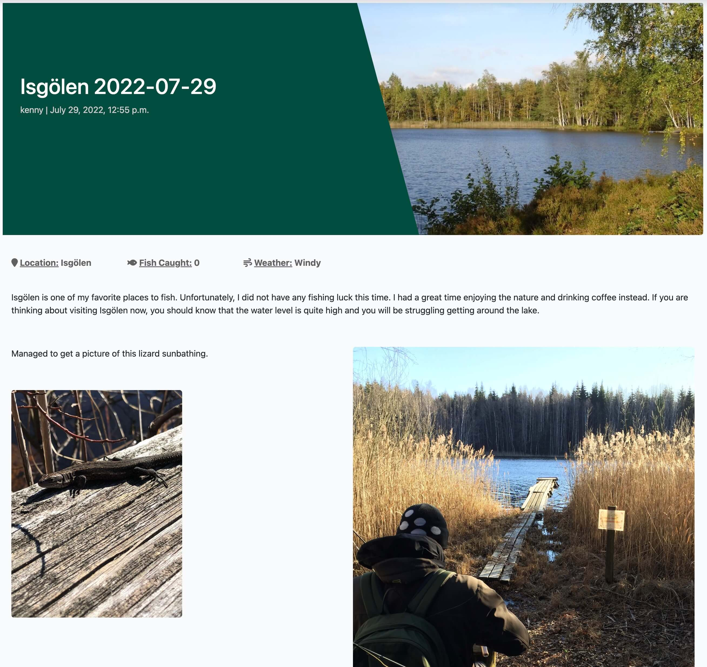
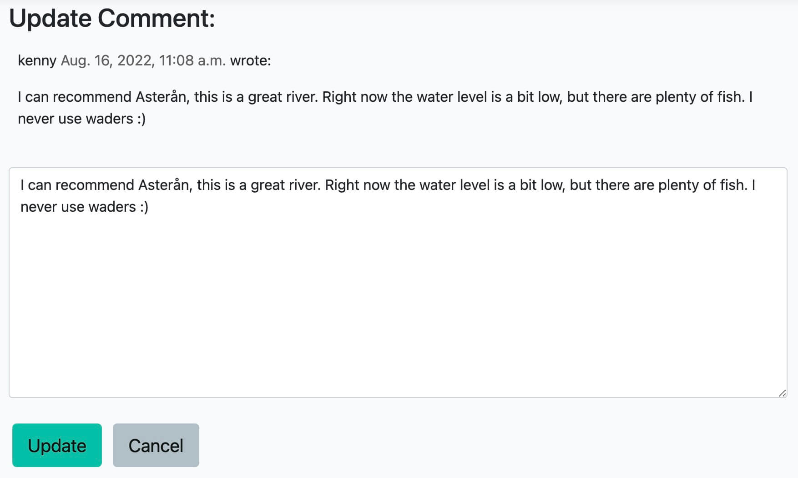
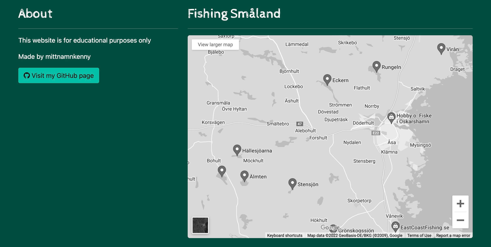
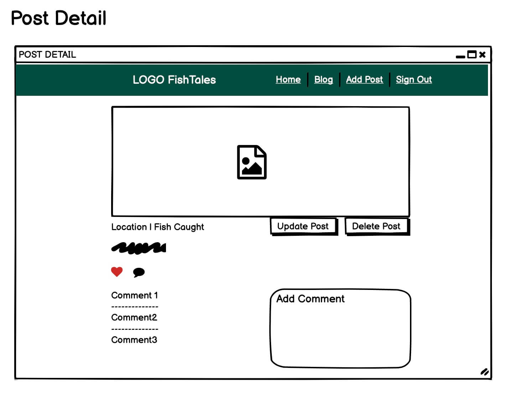
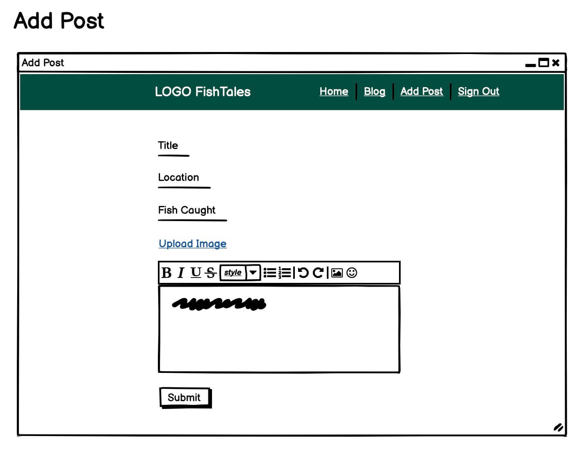
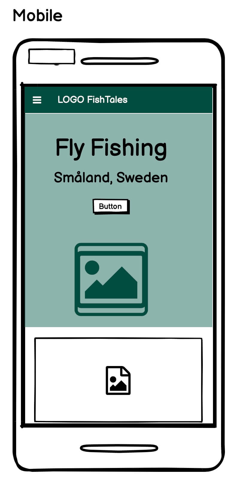

# FishTales - Fly Fishing Blog

This is my fourth milestone project with Code Institute. FishTales is an Django blog application built for people who enjoy fly fishing. It is targeted towards people fishing in Småland, Sweden. 
The purpose of this site is to allow users to share their fishing stories, upload photos of possible catches as well as comment and like on other posts.

[View the live project here.](https://fishtales-mittnamnkenny.herokuapp.com/)

## Index – Table of Contents
* [User Experience (UX)](#user-experience-ux) 
* [Features](#features)
* [Design](#design)
* [Technologies Used](#technologies-used)
* [Testing](#testing)
* [Deployment](#deployment)
* [Credits](#credits)

## User Experience (UX)

### Project Goals:
The primary goal for this project is to create a fly fishing blog, that enables full CRUD functionality to register users so that they can Create, Read, Update and Delete both blog posts and comments directly on the site without any delays or intermediaries. The user should have full control over their own posts and that any changes made on the site are directly reflected to the user.

### Strategy:
An Agile methodology was used to plan this project. This was implemented using a Kanban board in GitHub Project with linked Issues. To cover the goals of this project, a total of 5 Epics where created, which were then further developed into 32 User Stories, each with their own acceptance criterias and tasks to complete. Labels where then used to prioritize the importance of each User Story. 28 User Stories were completed working on this project.

The following labels were used in this project and the distribution of user stories by label are:

  - Must-Have: 16/32
  - Should-Have: 7/32
  - Could-Have: 8/32
  - Probably-Won’t-Have: 1/32

For more information: [View the Kanban Board here.](https://github.com/mittnamnkenny/fishtales/projects/1)

### User stories:

  - #### EPIC Admin/Account
    - US1. Account registration and login:
      - As a **Site User** I can **register an account** so that **I can share my fishing stories, comment and like**
    - US2. Manage posts:
      - As a **Site Admin** I can **create, read, update and delete posts and comments** so that **I can manage my blog content**
    - US3. Create drafts:
      - As a **Site Admin** I can **create draft posts** so that **I can finish writing the content later**

  - #### EPIC Post
    - US4. View post list:
      - As a **Site User** I can **view a list of posts** so that **I can easily select one fishing story to read**
    - US5. Open a post:
      - As a **Site User** I can **click on a post** so that **I can read the content**
    - US6. Create post:
      - As a **Site User** I can **create my own posts** and **share my fishing stories**
    - US7. Edit post:
      - As a **Site User** I can **edit my own post** so that **I can update the content**
    - US8. Delete post:
      - As a **Site User** I can **delete my own post** so that **I can interact with the content**
    - US9. View own posts:
      - As a **Site User** I can **view my own posts** so that **I can get a better overview of my fishing stories**
    - US10. Multiple images:
      - As a **Site User** I can **add multiple images to my posts** so that **I can better share my fishing stories and possible catches**
    - US11. Placeholder photos:
      - As a **Site User** the **placeholder photo when creating a post will be based on my fishing location if no photo is uploaded** so the **blog will have more variation in photos**
    - US12. Fish caught:
      - As a **site user** I can **see the number of fish caught without entering the detail page for each post** so that **I can better select interesting posts**
    - US13. Weather info:
      - As a **site user** I can **see the weather conditions without entering the detail page for each post** so that **I can better select interesting posts**
    - US14. Number of comments:
      - As a **site user** I can **see the number of comments without entering the detail page for each post** so that **I can better select interesting posts**
    - US15. Number of likes:
      - As a **site user** I can **see the number of likes without entering the detail page for each post** so that **I can better select interesting posts**
    - US16. Restrict delete post:
      - As a **site user** I will **be prevented from deleting my own post if any comments have been made** so that **comments are protected and people are encouraged to comment more**
    - US17. Restrict blog view:
      - As a **site user** I will **not be able to view the blog content without signing in** so that **more users will register to the site**

  - #### EPIC Like
    - US18. View likes:
      - As a **Site User** I can **view the number of likes on each post** so that **I can see which is the most popular or viral**
    - US19. Like:
      - As a **Site User** I can **like a post** so that **I can interact with the content**
    - US20. Downvote:
      - As a **Site User** I can **downvote a post** so that **I can interact with the content**

  - #### EPIC Comment
    - US21. View comments:
      - As a **Site User** I can **view comments on an individual post** so that **I can read the conversation**
    - US22. Comment on a post:
      - As a **Site User** I can **leave comments on a post** so that **I can be involved in the conversation**
    - US23. Delete Comment:
      - As a **Site User** I can **delete my own comment** so that **I can interact with the content**
    - US24. Edit comment:
      - As a **Site User** I can **edit my own comment** so that **I can update the content**

  - #### EPIC UX/UI/ETC
    - US25. Responsive:
      - As a **Site User** I can **use the site on the following platforms: desktop, laptop, tablet and smartphone** so that **I can access all functionality**
    - US26. Design:
      - As a **Site User** I can **get an overall positive impression based on the principles of user experience design, accessibility and responsivity** so that **I can quickly determine the purpose of the site and enjoy using it**
    - US27. System messages:
      - As a **Site User** I will **get system messages when I interact with the site** so that **I get feedback when actions are completed**
    - US28. Hero image:
      - As a **Site User** I am **presented with a hero image** so that **I can clearly see the purpose of the site**
    - US29. Featurette:
      - As a **Site User** I am **presented with a featurette** so that **I can better understand the site’s purpose**
    - US30. Favicon:
      - As a **Site User** I am **presented with a favicon** so that **I can get a better experience when browsing with multiple tabs**
    - US31. Carousel:
      - As a **Site User** I can **view a carousel with new posts** so that **I can easily see any post updates to the blog**
    - US32. GitHub:
      - As a **Site User** I am **presented with a link to mittnamnkenny’s GitHub** so that **I can view more repositories**

  - #### User Stories not implemented
    - US9. View own posts:
      - This user story was prioritized as a could-have feature and will not be implemented at this stage due to low priority.
    - US16. Restrict delete post:
      - This user story was prioritized as a could-have feature and will not be implemented. I want the post author to have full control over their own posts.
    - US17. Restrict blog view:
      - This user story was prioritized as a Probably-Won’t-Have feature and will not be implemented. I want unregistered users to be able to view the blog content before choosing to register.
    - US20. Downvote:
      - This user story was prioritized as a could-have feature and will not be implemented. I do not think this contributes to an overall positive experience; the upvote functionality is enough for this purpose.

## Features

### Existing Features

#### Navigation bar:

The navbar is present on all pages of the site. It uses bootstrap's built-in class fixed-top, so when the user scrolls, it will remain fixed to the top of the browser's viewport and always visible to the user.

On the left-hand side of the navbar the user is presented with the logo; FishTales with a styled Font Awesome icon (fas-fish),  which when clicked will redirect the user to the home page.

The right-hand side contains the navigation links for the other pages of the site and depending on login status the following link will be present:
  - Not logged in: Home, Blog, Register, Login

  - Logged in: Home, Blog, Add Post, Logout, Username with included Font Awesome icon (fas fa-user)

The navbar is fully responsive, so when on smaller devices the navbar will collapse and the navigation links are accessed using a ”hamburger menu”.

View collapsed navbar:

#### Home page:

##### Home page - Hero section:

Positioned at the top of the home page, this is first presented to the user as they visit the site. It includes a background image featuring a man fly fishing on a river. 
The background image uses background attachment fixed on large screen sizes; this intends to give a nice effect when scrolling down the page. 

A large text overlay; Fly Fishing Småland, Sweden with an included link that will redirect the user depending on login status:
  - Not logged in: Register now - Register
  - Logged in: Visit the blog - Blog

At the bottom of the hero section there is an gradient svg-wave for a smoother transition to the featurette section, softr.io

When the user visits the site for the first time, they will clearly see that this is a fly fishing blog.

Hero section on mobile devices:

##### Home page - Featurette section:

Positioned below the hero section, the user is presented with three styled Font Awesome icons with included text describing the blog, which clearly identify the purpose of the site.
  - Blog - Fly Fishing Blog - (fas fa-circle-check)
  - Since - Created 2022 - (fas fa-clock)
  - From - Småland, Sweden (fas fa-earth-europe)

When on smaller devices the number of icons is reduced.
The featurette section uses a svg-background resembling a fishing net, svgbackgrounds.com

##### Home page - Resent posts section:

Further down the home page, the user can view the three most recent posts made to the blog.
This is featured on the home page so that the user can quickly see any blog updates.

At the top of this section there is a bootstrap carousel, a slideshow cycling through the three most recent post made. It will display the featured image that the user has uploaded when creating the post or a placeholder photo based on fishing location. A text overlay with chosen fishing location is also displayed, including Font Awesome icon (fas fa-location-pin).

Below the carousel the user can view the three latest blog posts with information including:
  - Featured image - Image that the user has uploaded when creating the post or a placeholder photo based on fishing location.
  - Author - post author
  - Location - Font Awesome icon (fas fa-location-pin), chosen fishing location
  - Fish caught - Font Awesome icon (fas fa-fish), default 0
  - Weather - Will display correct Font Awesome icon based on weather conditions
  - Title - Post title, 30 characters and appends an ellipsis
  - Content - Post content, 30 characters and appends an ellipsis if no excerpt provided
  - Date created - Post created on
  - Number of likes - Font Awesome icon (far fa-heart) followed by the number of likes
  - Number of comments - Font Awesome icon (far fa-comments) followed by number of comments

By clicking on the post, the user is redirected to the post detail page for that post.

#### Blog page:

The Blog page will present a paginated list of all blog posts on the site, limited to a maximum of six posts per page. Order the posts by date descending. The Blog page can easily be accessed using the provided navbar link.

For each post the following information is presented to the user:
  - Featured image - Image that the user has uploaded when creating the post or a placeholder photo based on fishing location.
  - Author - post author
  - Location - Font Awesome icon (fas fa-location-pin), chosen fishing location
  - Fish caught - Font Awesome icon (fas fa-fish), default 0
  - Weather - Will display correct Font Awesome icon based on weather conditions
  - Title - Post title, 30 characters and appends an ellipsis
  - Content - Post content, 30 characters and appends an ellipsis if no excerpt provided
  - Date created - Post created on
  - Number of likes - Font Awesome icon (far fa-heart) followed by the number of likes
  - Number of comments - Font Awesome icon (far fa-comments) followed by number of comments

This will give the user enough information to decide which blog post might appeal to them. 
By clicking on the post, the user is redirected to the post detail page for that post.

Blog page on mobile devices:

#### Add post page:

This feature is only available if a user chooses to register to the site and can be accessed using the provided navbar link. On the Add post page, the user will be able to share their fishing story and add photos to their post content using the included SummernoteWidget.

The following fields are required to submit a post:
  - Title - A default post title is presented to the user: Fishing datetime. The user can choose to change this, but it must be unique.
  - Location - The user can choose from the following fishing locations in Småland: Alsterån, Hällesjön, Isgölen and if the use chooses to fish somewhere else; other.
  - Fish caught - Number of fish caught. Default is 0.
  - Weather conditions - The user can choose from: Sunny, Cloudy, Windy, Rainy or Snowy, or leave it as default (…). Default will not display any weather information on the post.
  - Image - The user will be able to upload a photo to display as featured photo. If the user chooses not to upload any photo here, a placeholder photo based on the chosen fishing location will be displayed instead.
  - Content - Using the included features of SummernoteWidget the user will be able to customize their fishing story. The user is presented with a ”What you see is what you get” editor and can, with the included toolbar; upload photos, change text styles and more.

When all fields are completed and the user clicks on Submit, their post will be automatically added to the list of posts and the user is redirected to their blog post. If the user chooses to click on Cancel instead, the user will be redirected to the previous page visited.

#### Post detail page:

When a user chooses to click on a blog post, they are brought to the Post detail page. The user is shown the entirety of the post with a commenting section below. The user will be able to interact with the content depending on user status.

The following information will be presented to the user:
  - Featured image - Image that the user has uploaded when creating the post or a placeholder photo based on fishing location.
  - Title - Post title
  - Author - post author
  - Date created - Post created on
  - Location - Font Awesome icon (fas fa-location-pin). Location: chosen fishing location
  - Fish caught - Font Awesome icon (fas fa-fish). Fish caught: default 0
  - Weather - Will display correct Font Awesome icon based on weather conditions. Weather: Conditions
  - Content - Post content
  - Number of likes - Font Awesome icon (fa-heart) followed by the number of likes
  - Number of comments - Font Awesome icon (fas fa-comments) followed by number of comments
  - Comments - Order the comments by date ascending

Features dependent on user status:

  - User not logged in:
The comment form is not displayed to the user. Instead, the user is presented with the links to the Login- and Register page. User must be logged in to leave a comment.

  - User is logged in:
The comment form is presented to the user and the user can comment on the post. Once the user clicks on Submit, the comment is automatically approved and added to the list of comments. Automatically approving comments will encourage the user to continue commenting on posts, without any delays.
Font Awesome icon (fa-heart) changes colour and the user will be able to like/unlike the post.

  - User is post author:
The post author will have full CRUD functionality over their posts without any delays added.
They are presented with the option to update or delete their post.
Update this post - The user is redirected to the Update post page.
Delete this post - The user will have to confirm deleting their post; a modal is displayed to the user with the option to Delete or Cancel.

  - User is comment author:
The comment author will have full CRUD functionality over their comments without any delays added. They are presented with the option to update or delete their comments.
Update this comment - The user is redirected to the Update comment page.
Delete this comment - The user will have to confirm deleting their comment; a modal is displayed to the user with the option to Delete or Cancel.

Post detail on mobile devices:

#### Post update page:

The post author will be able to update their blog post using the Post update page, which can easily be accessed by clicking on Update this post on the Post detail page. The post author will have full control over their posts and can easily make changes or correct any mistakes in their post after it’s been published.

The Post update page will display the entirety of the blog post with all fields pre-populated.

Once the post author is finished updating their post and clicks on Update, the blog post will immediately update and the user will be redirected to the Post detail page for that post. If the user chooses to click on Cancel instead, the user will be redirected to the previous page visited.

#### Comment update page:

The comment author will be able to update their comment using the Comment update page, which can easily be accessed by clicking on Update this comment on the Post detail page. The comment author will have full control over their comments and can easily make changes or correct any mistakes in their comment after it’s been published.

The Comment update page will display the entirety of the comment, pre-populated.

Once the comment author is finished updating their comment and clicks on Update, the comment will immediately update and the user will be redirected to the Post detail page for that post. If the user chooses to click on Cancel instead, the user will be redirected to the previous page visited.

#### Register page:

To interact with the site, a user is required to register and login.
Unregistered users will be able to access the Register page in multiple ways: 
  - Using the provided navbar link 
  - Register Now link, in the Hero section on the Home page
  - Register link, in the Comment section on the Detail page
  - Using the link provided on the Login page

A new account can be easily created. The user needs to provide the following information:
  - Username - must be unique
  - E-mail - optional
  - Password - which must be entered twice

When all fields are complete and the user clicks on register and new account is automatically created and the user is redirected to the Home page.

#### Login page:

For full CRUD functionality on posts and comments, or the ability to like/unlike a post, a user is required to login to the site.
The Login page can be accessed:
  - Using the provided navbar link
  - Login link, in the Comment section on the Detail page
  - Using the link on the Register page

Provided that a user is registered to the site, the login process is very quick.  The user needs to enter the following information:
  - Valid username
  - Correct password

When the user enters a correct username with a matching password and clicks on Login, they are logged in and redirected to the Home page.

#### Logout page:

The Logout page can be accessed using the provided navbar link that is present when a user is logged in. When the user clicks on Logout, they are directly logged out of their account and redirected to the Home page.

If the user chooses to click on Cancel instead, the user will be redirected to the previous page visited.

#### Django Admin page:

To manage the blog content of the site, a superuser account was created. This allows a superuser to administer the site. The Admin page/panel can easily be accessed by logging in to the /admin URL with the superuser account.
From the admin panel, the superuser will be able to delete a specific post, comment or user. This functionality is necessary to maintain the blog and remove unwanted content. 

More functionality is available to the superuser in the admin panel, including creating post-drafts that can be published at a later moment.

#### System messages:

System/Flash messages are present throughout the site and will be displayed to the user as feedback when certain actions are completed. The message will appear at the top of the screen and after 2.5 seconds it will be automatically removed.

#### Footer:

The Footer is present on all pages of the site, featured at the absolute bottom. 
On the left-hand side there is an about section where the user can access my GitHub repository following the provided link, which opens in a new tab. Included Font Awesome icon (fa-brands fa-github).

The right-hand side includes an embedded Google Map with possible fishing places in Småland, Sweden. This will encourage the user to navigate the area and plan their own fishing trip.
The Google Map is removed on smaller devices.

#### Additional features:

  - Favicon.

  - Links and buttons will change colour when hovered over.

#### Meta Data:
FishTales Fly Fishing Blog

### Features to Implement in the future
  - US9. View own posts:
    - This user story was prioritized as a could-have feature and will not be implemented at this stage due to low priority.

## Design

### Wireframes

At the beginning of this project and as a part of the planning phase wireframes were created using Balsamiq. The wireframes were used to get a basic idea on how the site might look when finished, both on desktop and mobile devices.

Wireframes were created for the following pages and features:

Home page:

Blog page:

Post detail:

Add post:

Mobile devices:

### Data Model

This project is hosted on Heroku and the database used is Heroku PostgreSQL. 
Cloudinary is used to store all blog images. Two custom models were created for this project; Post and Comment. With the default Django User model already included.

Entity Relationship Diagram - Post:

Entity Relationship Diagram - Comment:

### Site map

To explain the structure of the site and how to navigate it, I created a site map using Lucidchart:

### Colours

To match the fly fishing theme of this project, teal was chosen as the main colour to use throughout the site. Teal or green is often used with fly fishing and will not be distracting to the user. Google Materialize color palette was used to select the hex colour codes.

With focus on accessibility and contrast, the following colours were chosen:

Other colours used:

  - #F9FAFC - Off-white, Background colour
  - #E84610 - Red, Like button
  - #0F1413 - Dark, text colour

### Typography

I have used font-family "Helvetica Neue", Helvetica, Arial, sans-serif for most of the text throughout the site. This is Bootstrap's default font, and this was chosen because it both looks good and is easy to read.

To make text stand out and catch the users attention, an outlined font is used on certain headings. 
Cabin Sketch a Google Web Font, was chosen because it goes well with the theme of the website and is easy to read, with sans-serif as a fallback if Cabin Sketch should fail to load.

### Imagery

All current images on the site and uploaded blog posts is provided by mittnamnkenny’s fishing trips, excepts the Hero image used on the Home page:

  - [Unsplash:](https://unsplash.com/photos/NtkCemIfaiU) Man fishing on river at daytime, Chris Sarsgard

This photo was chosen as the hero image to display on the front page. Photoshop was used to adjust the brightness and a gradient overlay was added to make the featured hero text stand out and more visible to the user.

## Technologies Used

## Testing

## Deployment

## Credits 